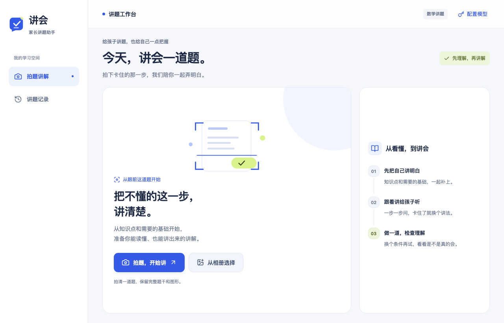

<div align="center">
  
  <h1>讲会 · TechPilot</h1>
  <p><strong>孩子问你一道题，你也能从容地陪他想一想。</strong></p>
  <p>先帮你弄明白，再陪你讲给孩子听。</p>
  <p>
    
    <a href="https://github.com/tianyoudoge/techpilot/stargazers"></a>
  </p>
  <p>
    <a href="#我会做可我不知道怎么讲">认识讲会</a> ·
    <a href="#今晚这道题可以这样讲">怎么用</a> ·
    <a href="#想试试讲会">试用情况</a> ·
    <a href="#developer-guide">开发者接入</a>
  </p>
</div>

---

<a id="我会做可我不知道怎么讲"></a>

## “我会做，可我不知道怎么讲。”

孩子把作业本推过来：“这道题怎么做？”

你看了看，似乎还能想起当年学过的方法。拿起笔算出答案，正准备讲，却发现自己也说不清：为什么这里要这么算？孩子又是从哪一步开始没听懂的？

有时候，连你也要先看一眼解析。看懂了，再换成孩子能听懂的话，又是另一回事。

**讲会想帮你把这中间的一段路走顺。**

拍下题目，先看看它用到了什么知识、有哪些基础需要补，再拿着一份分步骤的讲稿，陪孩子往下想。讲完之后，换一道题试一试，看看刚才那一步是不是真的明白了。

讲会面向陪小学生、初中生写作业的家长。当前版本先围绕初中数学打磨，其他年级和题型还需要逐步补齐。

<div align="center">
  
  <p><sub>从眼前这道题开始，先把自己弄明白。</sub></p>
</div>

## 陪写作业时，这些地方有人搭把手

### 你也忘了，就先补一补

有些知识离开学校太久，忘了很正常。讲会把这道题需要的知识和前面的基础放在一起，有解释、例子和图示。你可以先看懂，再决定从哪里讲起。

### 答案看懂了，接下来怎么开口？

讲稿会把解题过程拆成几步，给出可以问孩子的问题，以及孩子卡住时可以接着用的提示。你不用一边算题，一边临时组织整段讲解。

### 同一句话讲了几遍，孩子还是没明白

先停在卡住的那一步，看看是不是缺了一个前面的知识，或者换个更直观的讲法。一次补清楚一点，再接着往下走。

### “会了”之后，给他一次自己试的机会

讲完可以做一道类似题，再换个条件试试。孩子能不能独立往下做，比听完点头更容易看出哪里还需要帮忙。

### 今天没讲完，明天接着来

讲过的题、讲稿和进度会留在这台设备上。下次打开，从“最近讲过”里找回来，继续看上次停在哪里。

## 今晚这道题，可以这样讲

1. **拍下来。** 拍照或从相册选图，把要讲的那道题裁出来。
2. **自己先看一遍。** 看题目分析和讲解，选出孩子可能卡住的地方；遇到生疏的知识，先翻一下基础。
3. **和孩子一起往下想。** 按步骤问一问，听听他的回答。卡住了，就看看提示或换一种讲法。
4. **让孩子自己做一道。** 用类似题或变式题试试，把还不熟的地方记下来。

不一定要一口气讲完整道题。有时候，今晚能把昨天没懂的一步说清楚，就已经有了进展。

## 家长可能想问的几件事

### 我自己的数学也一般，能用吗？

可以先把它当成给自己准备的一份讲题资料。知识解释和例子帮助你复习，分步骤的讲稿帮助你开口。遇到自己仍没弄明白的地方，也可以先和孩子一起看看、算算，再对照老师的讲法。

### 是拍一下，就会替我把孩子教会吗？

拍题后会提供讲解、提示和练习。讲题时，仍需要你听孩子怎么想、看他怎么做，再决定是继续还是回头补一补。模型生成的内容也可能出错，有疑问时需要核对。

### 换个手机，上次讲的题还在吗？

目前记录保存在使用时的那台设备上，还不能跨设备同步。清除应用或浏览器数据，也会清掉本机记录。

### 拍下来的题会发到哪里？

识题时，题目图片会发送给你选择的模型供应商。照片和讲题笔记保存在本机；共享知识服务不接收原题照片或你的模型密钥。

## 想试试讲会？

目前还是早期测试版，已经在 iPhone 上走通讲题流程，也在完善浏览器和电脑上的体验。暂时没有可直接打开的公共体验网址，也还没有上架应用商店。

试用版需要先连接测试服务，并配置 DeepSeek 或阿里云百炼的模型密钥。这一步对普通家长还有门槛，是后续使用体验需要继续完善的地方。

如果你想自己运行，下面有接入说明；如果你更关心陪孩子讲题时能不能帮上忙，可以在 [Issues](https://github.com/tianyoudoge/techpilot/issues) 说说你最常遇到的困难。

---

<a id="developer-guide"></a>

## 开发者接入

公开仓库包含 H5、Tauri 原生壳、客户端文档与构建配置。Go 轻资产服务、生产管线、课程目录、转录和知识资产在独立私有仓库中；客户端构建不需要读取私有仓库。

### 运行 H5

需要 Node.js 22。在仓库根目录执行：

```sh
cd frontend
npm ci
npm run dev
```

浏览器打开 `http://localhost:5173/`。Vite 默认将 `/api` 转发至 `http://127.0.0.1:8080`，可通过 `API_PROXY_TARGET` 更换资产服务地址。完整讲题流程需要兼容的资产服务，当前仓库不附带私有知识库。

### 配置模型

在应用的“配置模型”中选择 DeepSeek 或阿里云百炼，再选择模型并填写对应的 API Key。弹窗提供获取密钥的入口，模型调用使用该供应商的账户额度。Key 保存在当前设备上。

### 平台与构建产物

| 平台 | 当前状态 |
| --- | --- |
| H5 | 可在浏览器运行；需要连接资产服务 |
| macOS / Windows / Linux | 已接入自动构建，可在 [Actions](https://github.com/tianyoudoge/techpilot/actions/workflows/clients.yml) 下载成功任务的产物 |
| iOS | 已在 iPhone 完成讲题流程测试，当前通过开发签名安装 |
| Android | 已产出 ARM64 调试 APK，真机验证仍待完成 |

当前原生包连接开发环境的局域网资产服务。构建产物仍需配置对应环境；各平台工具链和签名说明见[多端开发](docs/client-platform.md)。

### 构建和验证

```sh
cd frontend
npm run build
npm run test:e2e
npm run desktop:build
```

`npm run build` 包含 TypeScript 类型检查。端到端测试使用隔离数据，默认不消耗真实模型额度；首次运行需执行 `npx playwright install chromium`。桌面构建还需要 Rust 和对应平台的 Tauri 系统依赖。

### 图标与多端配置

页面标志的源文件为 [`brand-mark.svg`](frontend/src/assets/brand-mark.svg)。修改后在 `frontend` 执行 `npm run icons`，同步生成网页图标、桌面图标与已有 iOS/Android 工程的应用图标。

当前原生测试地址固定为 `http://192.168.0.112:5173`。更换环境时需同步修改平台地址、HTTP 权限和 iOS 的 ATS IP 例外，具体见[多端开发](docs/client-platform.md)。

### 阅读代码

- [前端代码导读](docs/前端代码导读.md)：面向有 JavaScript 基础的读者，说明 TypeScript、Vue 与模块分工。
- [客户端 README](frontend/README.md)：模块布局、存储与测试命令。
- [多端开发](docs/client-platform.md)：桌面、iOS、Android 的工具链和签名说明。
- [视觉设计规范](docs/讲会视觉设计规范.md)：标志、配色与页面排版。
