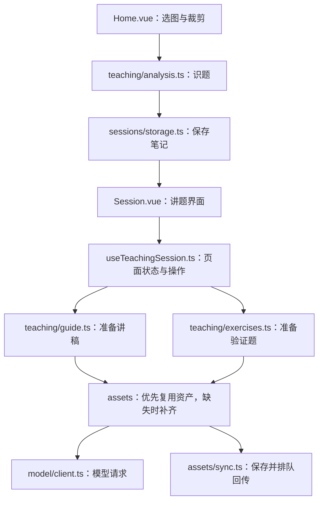

# 讲会前端代码导读

这份导读面向写过一点 JavaScript、还没学 TypeScript 的维护者。先看实际流程，再遇到类型语法时查下面的说明，不需要先学完 TS。

## 先建立一个整体印象

客户端负责识题、讲稿、练习和笔记；轻服务端提供知识资产、可复用讲解及老师片段目录。模型 Key 留在用户设备，由客户端直接调用供应商。H5 和 Tauri 共用前端业务代码，平台差异放在 `platform.ts`。



## 推荐阅读顺序

1. `frontend/src/pages/Home.vue`：从 `analyze` 开始，看裁剪后的照片怎样变成分析结果和一份本地笔记。
2. `frontend/src/pages/Session.vue`：看页面有哪些阶段。现在这里主要是模板，状态和操作来自 `useTeachingSession()`。
3. `frontend/src/composables/useTeachingSession.ts`：看 `load` 怎样恢复笔记，再读 `feedback`、`startExercise`、`submit` 怎样保存进度。
4. `frontend/src/lib/teaching/analysis.ts`、`guide.ts`、`exercises.ts`：看三个主要业务任务。
5. 最后看模型通信、资产同步和 IndexedDB。这些细节不影响你先理解界面流程。

## 每个模块负责什么

以下路径均相对 `frontend/src/`。

| 模块 | 职责 | 常见修改 |
| --- | --- | --- |
| `pages/` | 页面模板和页面入口 | 文案、按钮、布局 |
| `components/` | 可复用展示模块 | 裁剪器、公式、知识树、设置弹窗 |
| `composables/useTeachingSession.ts` | 当前讲题页面的响应式状态和用户操作 | 页面加载、讲题阶段切换、按钮动作 |
| `lib/teaching/analysis.ts` | 原题识别、孩子作答分析 | 识图输入与结果检查 |
| `lib/teaching/guide.ts` | 用知识资产和模板组织家长讲稿 | 讲稿上下文与输出检查 |
| `lib/teaching/exercises.ts` | 复用或生成类似题、变式题 | 匹配条件与独立复核 |
| `lib/teaching/asset-generators.ts` | 补齐缺失知识资产与讲法模板 | 缺失字段、复核、保存流程 |
| `lib/teaching/knowledge.ts` | 整理知识点与前置知识依赖 | 知识链的顺序和循环保护 |
| `lib/model/client.ts` | 请求排队、超时、取消、模型响应解析 | 网络行为 |
| `lib/model/prompts.ts` | 集中保存提示词 | 模型的输入要求；修改后需回归 |
| `lib/model-config.ts` | 本机模型设置与持久化 | 配置读取、保存、清除 |
| `lib/model-providers.ts` | DeepSeek、阿里云百炼的选项 | 供应商地址、模型名称、Key 帮助链接 |
| `lib/assets/bundle.ts` | 下载、缓存和合并知识资产 | 离线回退、版本、撤回处理 |
| `lib/assets/sync.ts` | 可复用资产回传队列 | 重试与回传字段 |
| `lib/sessions/storage.ts` | 保存、恢复、列出本地笔记 | 存储和旧数据迁移 |
| `lib/sessions/progress.ts` | 笔记状态规则及页面数据转换 | 重置当前轮次、掌握程度 |
| `lib/client-store.ts` | IndexedDB 的基础读写 | 数据表、事务 |
| `lib/platform.ts` | 浏览器和原生端能力差异 | iOS 局域网、选图、外链 |
| `lib/api.ts` / `api-client.ts` | 轻服务端请求及老师片段目录 | 服务端接口 |
| `lib/ui-state.ts` | 全局弹窗、登录兼容状态与短提示 | 通知和旧账号状态 |
| `lib/formatters.ts` | 时间、JSON、链接、章节名称 | 纯展示工具 |
| `lib/types.ts` 与各目录的 `types.ts` | 描述数据有哪些字段 | 前后端数据结构 |

`lib/local-llm.ts` 和 `lib/assets.ts` 保留原来的导出名称，供旧导入路径和测试使用；实际实现已移到上表目录。`api.ts` 也继续导出历史公共名称。新代码优先从实际负责该功能的文件导入。

## 看懂项目里常用的 TypeScript

TS 基本上是 JS 加上类型说明。类型在构建时被去掉；浏览器执行的仍然是 JS。

```ts
// JS 函数写法没变；冒号后只是说明输入、输出是什么。
function timeLabel(seconds: number): string {
  return `${Math.floor(seconds / 60)}:${seconds % 60}`;
}

// interface 描述对象的形状，不会在运行时创建对象。
interface Note {
  id: number;
  title: string;
  updatedAt?: string; // ? 表示这个字段可以不存在
}

// | 表示只允许其中一种；运行时依然是普通字符串。
const audience: "child" | "parent" = "child";

// import type 只导入类型说明，不会在运行时加载一个值。
import type { LocalSessionState } from "./lib/sessions/types";
```

| 你会看到的写法 | 怎么读 |
| --- | --- |
| `string[]` | 字符串数组 |
| `Promise<Guide>` | 异步操作最终返回一个讲稿对象，通常用 `await` 拿结果 |
| `read<LocalSessionState>(...)` | 告诉编译器“这次读取按笔记结构来用”；`T` 是可替换的类型名 |
| `Record<string, number>` | 普通对象：键是字符串，值是数字 |
| `Partial<Question>` | 题目对象，但允许只提供其中一部分字段 |
| `unknown` | 暂时不知道类型，使用前应检查 |
| `steps is Step[]` | 函数返回 true 时，编译器就按 Step 数组看待 steps；检查本身仍要由函数完成 |
| `as Exercise` | 告诉编译器按这个类型看待数据，不会转换或验证数据 |
| `value!` | 告诉编译器此处一定不是空值；判断错误仍会在运行时报错 |
| `as const` | 保留具体的字面量类型，例如把表名限制为几个固定名字 |

`?.` 和 `??` 是 JavaScript 本身的语法：`guide?.steps` 在 guide 为空时返回 undefined；`s.method ?? "standard"` 在 method 是 null/undefined 时使用默认值。

类型声明不能替代运行时检查。模型回复来自外部，所以 `analysis.ts`、`guide.ts`、`exercises.ts` 仍检查必需字段、步骤顺序与复核结果；把数据写成 `as AnalysisOutput` 不会让错误数据自动变正确。

## Vue 最需要理解的四个概念

```ts
const loading = ref(false);              // 一个可被 Vue 追踪的值
loading.value = true;                    // 在 TS/JS 中用 .value 读写
const busy = computed(() => loading.value); // 根据其他值算出新值
watch(() => route.params.id, load);      // 笔记 ID 变化时重新加载
```

模板里 Vue 会自动展开 ref，所以写 `v-if="loading"`，不用写 `.value`。`useTeachingSession()` 是 composable，即一个把相关 Vue 状态和操作放在一起的普通函数；它不是另一种语言或特殊类。

`.vue` 文件中，`<script setup lang="ts">` 是脚本，`<template>` 是 HTML 风格的界面模板，`<style scoped>` 是只作用于当前模块的样式。`@click="submit('CORRECT')"` 类似绑定点击回调，`v-for` 类似遍历数组，`v-if` 类似条件判断。

## 改代码时应保留的规则

- 先复用服务端已有资产，再考虑模型生成；新资产复核通过后才保存和回传。
- 照片、原题、笔记和 API Key 不进入可共享资产的回传对象。
- 原来的 localStorage 键和 IndexedDB 表名保持不变，避免升级后丢设置或历史。
- 讲题页面的 `version` 用来防止旧请求覆盖新路由的数据，不要当成无用变量删掉。
- iOS 局域网资产请求走 WebView，供应商调用走原生 HTTP。换电脑 IP 要同时改 `platform.ts`、HTTP 权限和 `Info.ios.plist` 中的 IP 例外。
- 旧服务端笔记仍保留兼容分支，正常新笔记走本地流程。

## 验证修改

```sh
cd frontend
npm run build      # 先检查 TS 类型，再生成构建产物
npm run test:e2e   # 默认浏览器回归，模型请求使用测试数据
```

单独验证资产和模型设置：

```sh
npx playwright test tests/client-assets.spec.ts tests/native-assets.spec.ts tests/model-settings.spec.ts
```

iOS 的 Xcode 构建前要先生成最新前端产物。只执行 `xcodebuild` 不会替你执行 `npm run build`；具体工具链步骤见 [客户端多端说明](client-platform.md)。

## 页面生命周期与弹窗

`App.vue` 用 KeepAlive 缓存首页，因此首页切换出去时会触发 `onDeactivated`，回来触发 `onActivated`。前者取消识题并让旧请求失效，后者重新读取记录；照片与裁剪组件保留在内存中。`useAppDialog.ts` 集中处理模型弹窗的焦点、滚动锁和可视窗口，关闭时恢复原状态。新增交互时可以对照 [应用形态验收](应用形态验收.md)。
